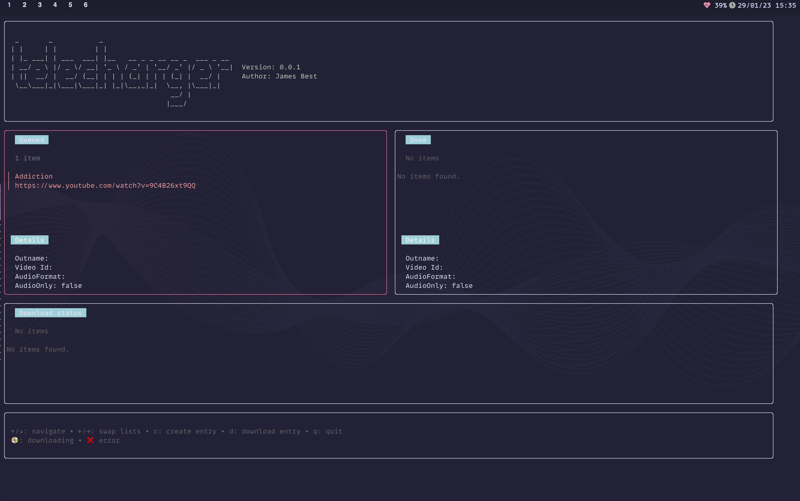
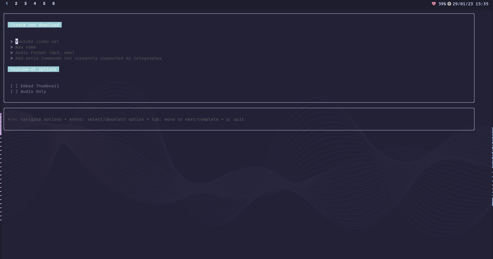

<h1 align="center">Welcome to telecharger</h1>
<p>
  <a href="https://twitter.com/jimgbest" target="_blank">
    
  </a>
</p>

> Telecharger is a [Youtube-DL](https://github.com/ytdl-org/youtube-dl) TUI




Telecharger is a [Youtube-DL](https://github.com/ytdl-org/youtube-dl) TUI. It provides the ability to build lists of videos you wish to download, rename the files, saving as audio only and a host of other functionality.

Not all the flags that youtube-dl allows are supported yet but you can provide them as a string on the form and telecharger will sort the rest out for you.

<details>
  <summary>Example</summary>

Adding the following extra commands

`--add-metadata --write-all-thumbnails --embed-thumbnail --write-info-json --embed-subs --all-subs`


</details>

The SQLite database is created in a `telecharger` directory in your home directory. In the future config will likely live here too.

## Requirements

- [Youtube-DL](https://github.com/ytdl-org/youtube-dl)
- [FFMPEG](https://ffmpeg.org/)

**Warning**

I have not tested this on windows and doubt it will work there. Sorry.

## Install

```sh
go install github.com/jim-at-jibba/telecharger@latest
```

## Usage

```sh
telecharger
```

## Todo

- [ ] Figure out how to stream output from download to viewport
- [ ] Add more options to form
- [ ] Figure out better way to do focus state, rather than duplicating views
- [x] Add ability to delete queued items
- [ ] Add terminal notify to success/error events
- [ ] limit done query to 10 items

## Author

👤 **James Best**

- Website: jamesbest.uk
- Twitter: [@jimgbest](https://twitter.com/jimgbest)
- Github: [@jim-at-jibba](https://github.com/jim-at-jibba)

## Show your support

Give a ⭐️ if this project helped you!
