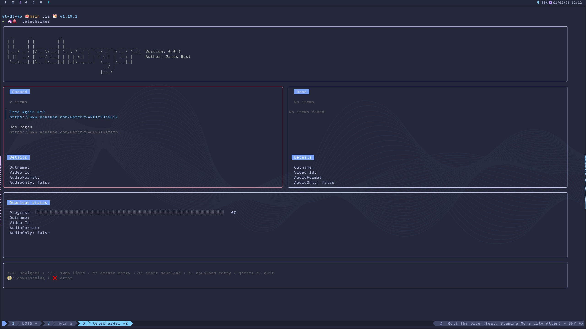

<h1 align="center">Welcome to telecharger</h1>
<p>
  <a href="https://twitter.com/jimgbest" target="_blank">
    
  </a>
</p>

> NB - Due to issues with youtube-dl, I have made the decsion to switch to `yt-dlp` instead

> Telecharger is a [yt-dlp](https://github.com/yt-dlp/yt-dlp) TUI




Telecharger is a [yt-dlp](https://github.com/yt-dlp/yt-dlp) TUI. It provides the ability to build lists of videos you wish to download, rename the files, saving as audio only and a host of other functionality.

Not all the flags that youtube-dl allows are supported yet but you can provide them as a string on the form and telecharger will sort the rest out for you.

<details>
  <summary>Example</summary>

Adding the following extra commands

`--add-metadata --write-all-thumbnails --embed-thumbnail --write-info-json --embed-subs --all-subs`


</details>

The SQLite database is created in a `telecharger` directory in your home directory. In the future config will likely live here too.

## Requirements

- [yt-dlp](https://github.com/yt-dlp/yt-dlp)
- [FFMPEG](https://ffmpeg.org/)
- For Notifications
  - [MacOS](https://github.com/julienXX/terminal-notifier)
  - Linux: `spd-say` should come with your distro

**Warning**

I have not tested this on windows and doubt it will work there. Sorry.

## Install

```sh
go install github.com/jim-at-jibba/telecharger@latest
```

## Configuration

### Configuration directory

Telescharger stores your configuration at the following path:

- on MacOS: `~/.config/telecharger`
- on Linux `${XDG_CONFIG_HOME}/telecharger`

If there more configuration options that you would like to see in Telecharge, please submit an issue.

| Option          | Default                           | Description                               |
| --------------- | --------------------------------- | ----------------------------------------- |
| enable_logging  | false                             | Enables bubbletea logging                 |
| download_folder | `.` you current working directory | Set the download location for telecharger |

## Usage

```sh
telecharger
```

## Todo

- [x] Figure out how to stream output from download to viewport
- [ ] Auto start next download
- [ ] Allow multiple downloads at once
- [ ] Add more options to form
- [ ] Figure out better way to do focus state, rather than duplicating views
- [x] Add ability to delete queued items
- [ ] Populate details when item is selected
- [x] Add terminal notify to success/error events
- [ ] limit done query to 10 items

## Author

👤 **James Best**

- Website: jamesbest.uk
- Twitter: [@jimgbest](https://twitter.com/jimgbest)
- Github: [@jim-at-jibba](https://github.com/jim-at-jibba)

## Show your support

Give a ⭐️ if this project helped you!
