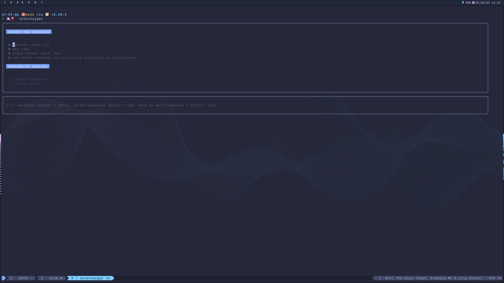

<h1 align="center">Welcome to telecharger</h1>
<p>
  <a href="https://www.npmjs.com/package/telecharger" target="_blank">
    
  </a>
  <a href="https://twitter.com/jimgbest" target="_blank">
    
  </a>
</p>

> Youtube DL TUI




Telecharger is a [Youtube-DL](https://github.com/ytdl-org/youtube-dl/blob/master) TUI. It provides the ability to build lists of videos you wish to download, rename the files, saving as audio only and a host of other functionality.

Not all the flags that youtube-dl allows are supported yet but you can provide them as a string on the form and telecharger will sort the rest out for you.

## Install

```sh
go install github.com/jim-at-jibba/telecharger@latest
```

## Usage

```sh
telecharger
```

## Todo

- [ ] Figure out how to stream output from download to viewport
- [ ] Add more options to form
- [ ] Figure out better way to do focus state, rather than duplicating views

## Author

👤 **James Best**

- Website: jamesbest.uk
- Twitter: [@jimgbest](https://twitter.com/jimgbest)
- Github: [@jim-at-jibba](https://github.com/jim-at-jibba)

## Show your support

Give a ⭐️ if this project helped you!
